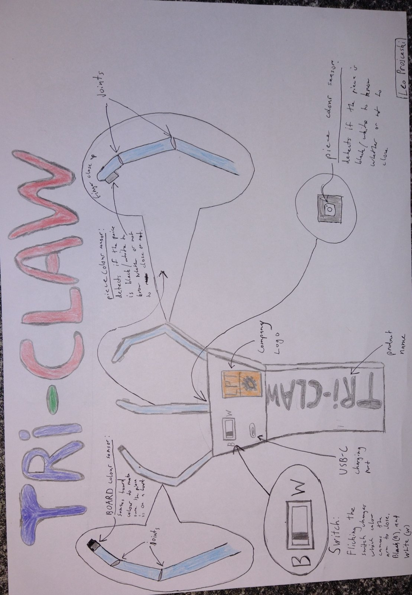

# TriClaw

## Product info

### What it is
This product is an arm attachment for amputees which will help them move chess pieces easily on the board without it being hard for them. 

### How it works
The arm attachment will include 3 fingers (these fingers being the thumb, index and middle finger) and will have sensors which detect the different colour pieces on the board, and the colour of the squares on the board itself. I have decided to only use three fingers of a hand for this arm attachment as most people when playing chess only use those three fingers to grab pieces as it is more efficient and avoids collision with surrounding pieces

The arm attachment will also contain a switch which when flicked will change if the attachment closes when it detects black or white. Once it is detected, it will close onto the piece for 3 seconds before releasing again.

## Group members
- Leo

> In charge of building the prosthetic

- Shafeen

> In charge of sensors

- Kevin

> In charge of code